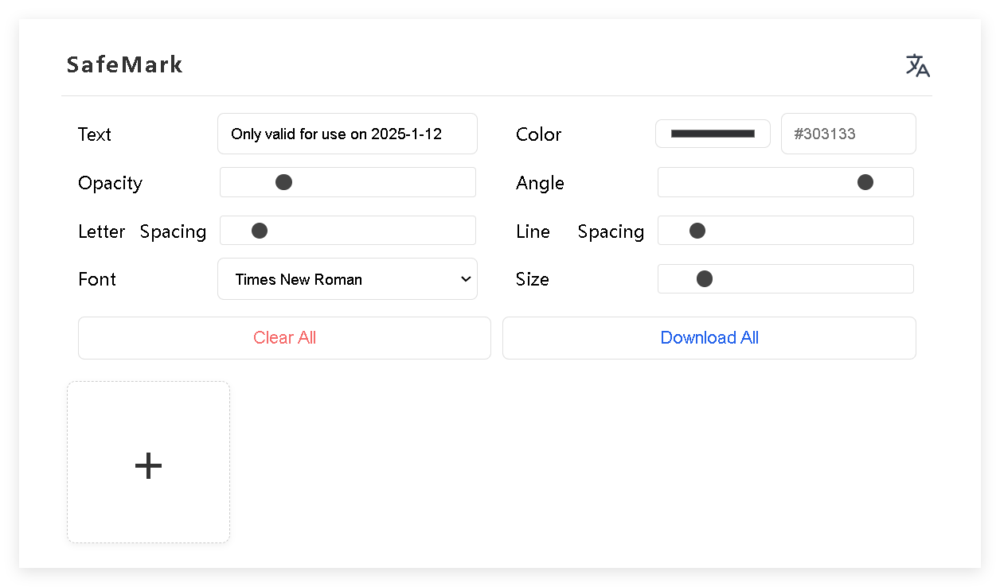

# SafeMark

Ready to use, completely offline, securely add watermarks to your private images.

**Demo**: https://safemark.pages.dev

🔒 **Completely Offline**: No internet connection required, ensuring your privacy and security.

🚀 **Flexible Image Support**: Easily add watermarks to multiple images at once using drag-and-drop, multiple selection, or direct pasting.

🎨 **Customizable Watermarks**: Tailor your watermarks by adjusting text color, opacity, angle, letter spacing, and line spacing, with a variety of font options available.

